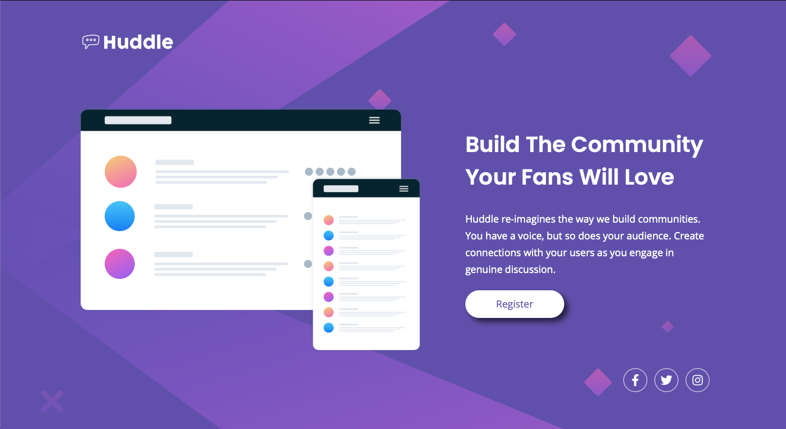

# Frontend Mentor - Huddle landing page with single introductory section solution

This is a solution to the [Huddle landing page with single introductory section challenge on Frontend Mentor](https://www.frontendmentor.io/challenges/huddle-landing-page-with-a-single-introductory-section-B_2Wvxgi0). Frontend Mentor challenges help you improve your coding skills by building realistic projects. 

## Table of contents

- [Overview](#overview)
  - [The challenge](#the-challenge)
  - [Screenshot](#screenshot)
  - [Links](#links)
- [My process](#my-process)
  - [Built with](#built-with)
  - [What I learned](#what-i-learned)
  - [Continued development](#continued-development)
  - [Useful resources](#useful-resources)
- [Author](#author)

**Note: Delete this note and update the table of contents based on what sections you keep.**

## Overview

### The challenge

Users should be able to:

- View the optimal layout for the page depending on their device's screen size
- See hover states for all interactive elements on the page

### Screenshot



### Links

- Solution URL: [github]
- Live Site URL: [netlify]

## My process

### Built with

- Semantic HTML5 markup
- SASS
- Flexbox
- CSS Grid
- **Desktop**-first workflow

### What I learned

This was my first project on frontendmentor.io and in some ways my first "real" project ever. I'm only just beginning to learn. In the past I read a lot about HTML and CSS, I watched guides on YouTube and such, and I tried to make sites, but that was mostly me making up the design on the go. Frontend Mentor helps a lot because... well, I'm no web designer, and these challenges will hopefully make me learn what building "real" sites is like. 

That being said, I didn't find this project particularly difficult. It *is* a junior level project, I wanted to start out small, but still, I'm happy with how it turned out. One thing I do know I have to learn in the future is the whole mobile-first workflow. I did this project desktop-first, as mentioned above. It just feels more natural to do it that way, I do it on the screen size of my computer and work my way down from there. But I do realise that there advantages to do mobile first, so I'll try to to learn that workflow. 

Another thing I need to do is figure out a way to organise the individual CSS properties better. So far it's a mess, see here: 

```css
a {
  display: inline-block;
  color: $purple;
  font-size: 1.25rem;
  padding: 18px 60px;
  background-color: $white;
  border-radius: 50px;
  margin-top: 25px;
  line-height: 1;
  min-width: 200px;
  text-align: center;
  box-shadow: 8px 8px 12px darken($purple, 30%);
  transition: background-color 200ms ease-in-out, color 200ms ease-in-out;

  &:hover {
    background-color: $magenta;
    color: $white;
  }

  @include breakpoint(medium) {
    font-size: 0.875rem;
    padding: 15px 75px;
  }
}
```
Like I said, a mess, one thing over the other. 

Other than that, I didn't really have any problems building the site. It was a simple one, after all. 

### Continued development

Well, for the most part I want to expand my knowledge of CSS. This site was very basic, but I need to learn more about CSS grid and flexbox. I also want to learn how to make expandable menus, that's something I don't know yet. Or if a site has links in the header which in the mobile version shrink into a menu that you activate by clicking a button. 

### Useful resources

- [CSS Tricks](https://css-tricks.com/) - This helped me a lot, you can look basically every single CSS property there is. 
- [MDN Web Docs](https://developer.mozilla.org/en-US/docs/Learn) - Amazing for pretty much the same reason as CSS Tricks. But where on CSS tricks I could find the individual properties, this site I found more useful for things like proper syntax. 

## Author

- Frontend Mentor - [@Jay-Darhk](https://www.frontendmentor.io/profile/Jay-Darhk)